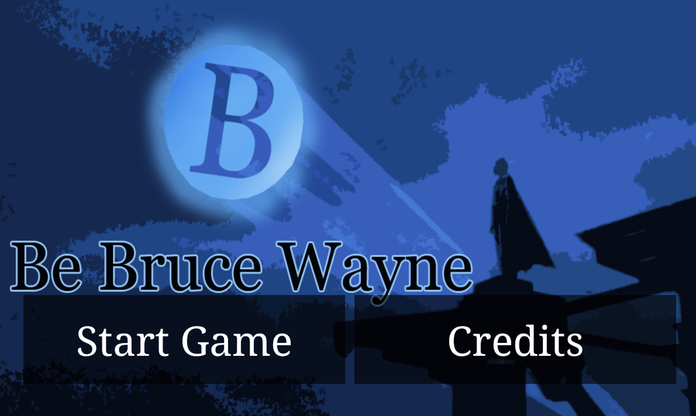
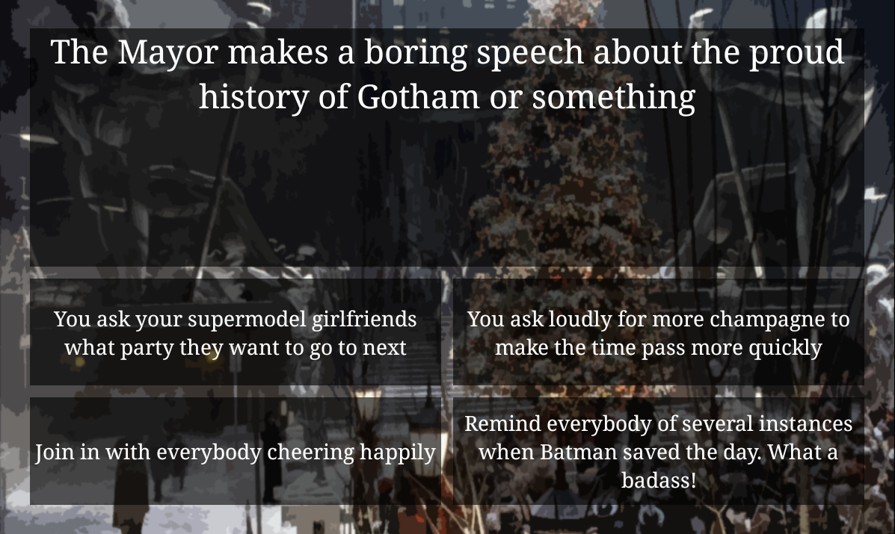

# Be Bruce Wayne

    

Native Android Game about being Bruce Wayne and not letting slip that you are secretly Batman. Created in 8 hours for the Berlin Mini Game Jam by Till Balbach, Nadine Kost & Matthias Zarzecki.

